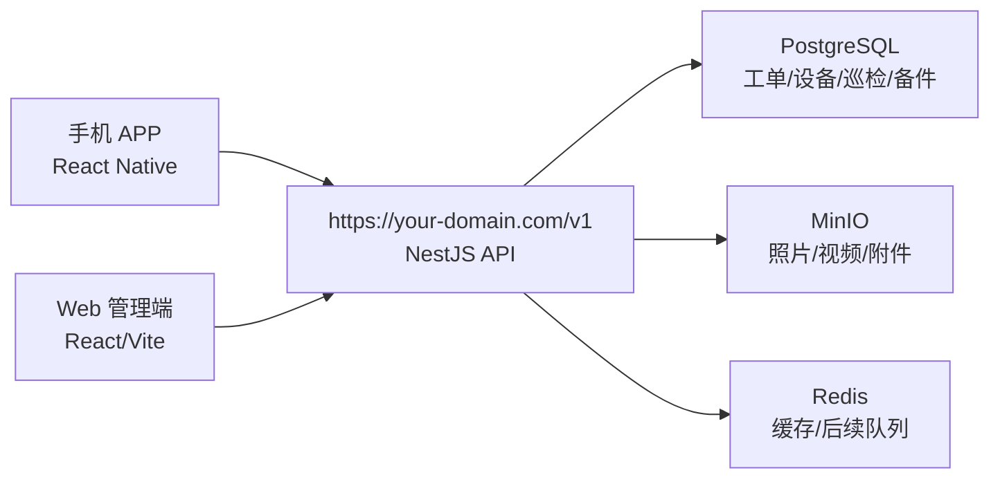

# 甲骨文云 ARM 部署与多端同步说明

本文档记录 W-Light 后续部署到 Oracle Cloud ARM 服务器时的推荐逻辑。核心原则只有一个：移动 APP 和 Web 管理端不各自存一套业务数据，而是同时连接同一个云端后端。

## 同步架构



- 临时无域名时，手机端登录页的“服务器地址”填写 `http://服务器IP:3005/v1`。
- 有域名和 HTTPS 后，手机端登录页的“服务器地址”填写 `https://your-domain.com/v1`。
- Web 管理端生产部署时与 API 使用同一个入口，浏览器访问 `/v1` 会被 Web 容器内的 Nginx 反向代理到后端。
- 只要两端连接的是同一个 API，工单、设备、巡检、备件、上传附件都会写入同一套 PostgreSQL/MinIO，自然保持同步。
- 离线模式后续会增加本地队列；当前阶段以在线实时同步为主。

## Oracle Cloud 准备

建议使用 Ubuntu ARM 实例。安全列表/防火墙至少开放：

- `80`：HTTP，用于申请证书或临时访问。
- `443`：HTTPS，正式给 Web 和手机端使用。
- `3005`：当前 Docker 一键部署默认 Web 入口；无域名内测时访问 `http://服务器IP:3005`。
- `3000`：API 容器默认只绑定服务器本机 `127.0.0.1`，不建议在公网开放。
- `9001`：MinIO 管理后台默认只绑定服务器本机，仅内网或临时开放。

服务器初始化：

```bash
sudo apt update
sudo apt install -y ca-certificates curl git
curl -fsSL https://get.docker.com | sudo sh
sudo usermod -aG docker $USER
```

执行 `sudo usermod` 后重新登录 SSH，让当前用户获得 Docker 权限。

## 一键部署（推荐）

```bash
curl -fsSL https://raw.githubusercontent.com/tony-wang1990/W-Light/main/scripts/oracle-arm-deploy.sh | bash -s -- --port 3005
```

脚本会自动安装 Docker、拉取/更新仓库、生成 `.env` 强随机密钥、构建镜像并启动服务。部署完成后访问：

- Web 管理端：`http://服务器IP:3005`
- API 健康检查：`http://服务器IP:3005/v1/health`
- 手机 APP 服务器地址：`http://服务器IP:3005/v1`

如果浏览器仍然连接失败，先确认 Oracle Cloud 安全列表/NSG 已放行 TCP `3005`，再执行：

```bash
cd /root/W-Light
docker compose ps
docker compose logs -f --tail=100 api web
```

## 手动拉取与启动

```bash
git clone https://github.com/tony-wang1990/W-Light.git
cd W-Light
bash scripts/oracle-arm-deploy.sh --port 3005
```

当前 `docker-compose.yml` 会启动：

- `lightops-web`：Web/Nginx 入口，宿主机 `3005` 端口，负责静态页面和 `/v1` 反向代理。
- `lightops-api`：后端 API，容器内 `3000` 端口，宿主机默认只绑定 `127.0.0.1:3000`。
- `lightops-postgres`：业务数据库。
- `lightops-redis`：缓存与后续同步队列基础。
- `lightops-minio`：照片、视频、附件对象存储。

内测阶段可先访问：

```bash
curl http://127.0.0.1:3005/v1/health
```

如果健康检查路由后续调整，以后端实际路由为准。

## 数据库迁移

生产环境不要依赖 `synchronize` 自动改表，建议使用迁移脚本管理 PostgreSQL 结构。当前 Docker 部署默认设置 `DB_MIGRATIONS_RUN=true`，API 启动时会自动执行已提交的 TypeORM migration。

常用环境变量：

- `DB_SYNCHRONIZE=false`：生产环境保持关闭。
- `DB_MIGRATIONS_RUN=true`：Docker 部署默认随 API 启动自动执行迁移。
- `DB_SSL=false`：本机 Docker PostgreSQL 通常关闭；连接外部托管数据库且要求 SSL 时再改为 `true`。

## 反向代理

正式使用时建议用 Nginx 或 Caddy 提供 HTTPS。Web 静态文件走 `/`，API 走 `/v1`。

Nginx 示例：

```nginx
server {
    listen 80;
    server_name your-domain.com;

    location / {
        root /opt/W-Light/apps/web/dist;
        index index.html;
        try_files $uri $uri/ /index.html;
    }

    location /v1/ {
        proxy_pass http://127.0.0.1:3000/v1/;
        proxy_set_header Host $host;
        proxy_set_header X-Real-IP $remote_addr;
        proxy_set_header X-Forwarded-For $proxy_add_x_forwarded_for;
        proxy_set_header X-Forwarded-Proto $scheme;
    }
}
```

生产环境必须把默认数据库密码、Redis 密码、JWT 密钥、MinIO 密钥改成强密码，并配置 HTTPS。

## Web 管理端

Web 端 API 基础路径当前是 `/v1`。Docker 部署时 `lightops-web` 已内置 Nginx 配置，会把 `/v1` 转发到 `lightops-api`，无需单独手写 Nginx。

```bash
docker compose up -d --build
```

如果以后改为宿主机 Nginx/Caddy 托管，也可以把 `apps/web/dist` 交给 Nginx/Caddy，并将 `/v1` 代理到 `127.0.0.1:3000/v1`。

## 手机 APP

手机端已经支持运行时配置后端地址：

1. 打开 APP 登录页。
2. 在“服务器地址”填写 `https://your-domain.com/v1`。
3. 登录后，APP 会把该地址保存到本机，后续所有接口和 token 刷新都会使用这个地址。

如果只是服务器代码更新，手机端通常不需要重新安装；如果修改了手机端界面或原生依赖，则需要重新打包 APK/IPA。

## 更新代码

服务器后续同步 GitHub 最新代码：

```bash
cd /root/W-Light
git pull
bash scripts/oracle-arm-deploy.sh --port 3005
docker compose ps
```

建议每次更新前备份数据库和 MinIO 数据卷，尤其是进入真实项目试运行后。
