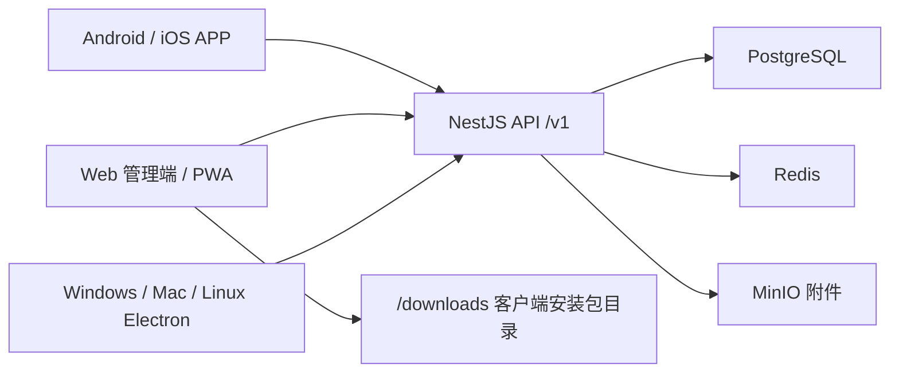

# W-Light 文旅灯光运维一体化平台

W-Light 是面向文旅灯光项目的运维闭环和灯光师工具箱平台。系统包含云端后端、Web 管理端、React Native 手机 APP、Electron 桌面客户端和共享灯光工具核心库。

当前版本：`0.9.0-internal.0`。当前阶段：**内测验收与生产加固阶段**。服务器部署、Web 登录、核心菜单和客户端打包入口已经具备，下一步重点是按验收清单把业务流程、权限、安全、备份、客户端真机安装全部跑稳。

## 当前进度

| 模块 | 状态 | 说明 |
| --- | --- | --- |
| 服务器部署 | 已完成基础版 | 支持 Ubuntu/Debian、ARM64/AMD64、1C1G 小机器、默认 3005 端口、Docker Compose 部署 |
| Web 管理端 | 已进入内测 | 项目、工单、维修台账、设备、备件、巡检、报表、用户、工具箱、客户端下载中心已接入 |
| 后端 API | 已进入内测 | NestJS + PostgreSQL + Redis + MinIO，已修复工单号并发、库存事务、uuid 字段迁移、分页排序 500 |
| 手机 APP | 内测打包入口已具备 | Android 可打 APK；iOS 需要 macOS + Xcode + Apple Developer 签名环境 |
| Windows/Mac/Linux 桌面端 | 打包入口已具备 | Windows 可本机生成安装包；Mac/Linux 需要对应平台构建和签名/公证 |
| 生产运维 | 进行中 | 已有部署、管理员、备份脚本；仍需定时备份、HTTPS、监控、正式验收 |
| 自动化测试与发布质量 | 进行中 | 后端 11 个测试套件、42 个用例；已覆盖核心业务、HTTP 冒烟、路由映射、数据库迁移 SQL 和完整 App HTTP e2e；lint 剩余 48 个 warning，仍需 PostgreSQL 容器级 e2e 与真机验收 |

详细验收和剩余工作见 [PRODUCTION_ACCEPTANCE.md](PRODUCTION_ACCEPTANCE.md)，版本记录见 [CHANGELOG.md](CHANGELOG.md)，发布流程见 [RELEASE.md](RELEASE.md)。

## 功能范围

### 运维闭环

- 工单创建、派单、接单、拒单、挂起、恢复、提交验收、验收通过、验收退回、取消和归档。
- 维修过程记录，支持维修步骤、配件消耗、外协信息和维修费用。
- 备件库存入库、出库、低库存预警，工单维修记录中扣减库存已放入事务。
- 巡检计划、今日巡检、巡检记录，异常巡检可自动生成维修工单。
- 设备台账、二维码/设备编号查询、设备详情、维修历史联动。
- 报表与数据：运营汇总、周趋势、设备状态、备件消耗排行、工单 Excel 导出、项目 JSON 备份/恢复预检。

### 灯光师工具箱

- DMX 地址计算、功率/负荷计算、光束角计算、照度计算。
- BPM 手动打拍、LTC 时码、RGB/色温配色。
- 故障诊断、MA 宏命令参考、行业术语、灯库制作、灯位设计、灯光理论工具。

### 多端客户端

- Web 管理端：浏览器访问服务器即可使用。
- Android APP：通过打包脚本生成 APK，可放入服务器下载中心。
- iOS APP：代码和脚本已准备，必须在 macOS + Xcode + Apple 签名环境生成 IPA/TestFlight 包。
- Windows/Mac/Linux 桌面端：Electron 客户端，连接同一云端 API，数据与 Web/手机端同步。

## 架构



## 目录结构

- `services/backend/`：NestJS 后端，TypeORM migrations，PostgreSQL/Redis/MinIO 接入。
- `apps/web/`：React + Vite Web 管理端，也是 Electron 桌面端的内容源。
- `apps/LightOps/`：React Native 手机 APP，包含 Android 和 iOS 原生工程。
- `apps/desktop/`：Electron 桌面客户端。
- `packages/toolbox-core/`：灯光工具箱计算核心。
- `scripts/`：服务器部署、备份、管理员重置、Android/iOS/桌面端打包脚本。
- `deploy/downloads/`：Web 容器挂载的客户端安装包下载目录。

## 服务器一键部署

支持 Ubuntu/Debian 的 ARM64 和 AMD64 服务器，默认 Web 端口为 `3005`。

```bash
git clone https://github.com/tony-wang1990/W-Light.git /root/W-Light
cd /root/W-Light
bash scripts/server-deploy.sh --port 3005
```

创建或重置管理员：

```bash
cd /root/W-Light
bash scripts/server-admin.sh --phone 13800000001 --password 'WLight@2026'
```

访问地址：

- Web：`http://服务器IP:3005`
- API 健康检查：`http://服务器IP:3005/v1/health`
- 客户端下载中心：`http://服务器IP:3005/clients`
- 静态下载目录：`http://服务器IP:3005/downloads/`

登录填写：

- Web 同源登录页的服务器地址可填 `/v1`。
- 手机 APP 和桌面客户端建议填完整地址：`http://服务器IP:3005/v1`。
- 生产环境必须修改默认管理员密码，并使用强随机 `.env` 密钥。

## 服务器更新

推荐使用带备份、健康检查和失败回滚的升级脚本：

```bash
cd /root/W-Light
bash scripts/server-upgrade.sh --branch main --port 3005
```

如果升级失败，脚本会自动尝试把应用代码切回升级前 commit，并提示升级前备份目录。数据库恢复是破坏性动作，只有确认需要时再手动执行 `scripts/server-backup.sh --restore ... --yes`。

手动更新命令如下，适合排障或临时处理：

```bash
cd /root/W-Light
git pull --ff-only
docker compose build api web
docker compose up -d --remove-orphans
docker compose logs -f --tail=120 api
```

确认当前代码版本：

```bash
git rev-parse --short HEAD
```

常用排障：

```bash
cd /root/W-Light
bash scripts/server-health.sh
docker compose ps
docker compose logs --tail=120 api
docker compose logs --tail=120 web
curl -i http://127.0.0.1:3005/v1/health
```

云服务器还需要在安全组/防火墙放行 TCP `3005`。绑定域名和 HTTPS 后，建议统一使用 `https://域名/v1` 作为所有客户端 API 地址。

## 备份与恢复

整机生产备份脚本会备份 PostgreSQL、MinIO 附件和 `.env` 快照，并生成 SHA256 校验清单。备份完成后脚本会自动校验 SQL dump、MinIO 压缩包和校验文件。

```bash
cd /root/W-Light
bash scripts/server-backup.sh
```

查看和校验备份：

```bash
cd /root/W-Light
bash scripts/server-backup.sh --list
bash scripts/server-backup.sh --verify /root/W-Light/deploy/backups/20260603-120000
```

恢复会覆盖当前 PostgreSQL 和 MinIO 数据。交互执行时需要手动输入确认；自动化脚本中必须显式加 `--yes`：

```bash
cd /root/W-Light
bash scripts/server-backup.sh --restore /root/W-Light/deploy/backups/20260603-120000 --yes
```

清理旧备份，例如保留最近 14 个备份目录：

```bash
cd /root/W-Light
bash scripts/server-backup.sh --prune --keep 14 --yes
```

安装每日凌晨 3:15 自动备份，并在每次备份后保留最近 14 个备份目录：

```bash
cd /root/W-Light
bash scripts/server-backup.sh --install-cron --cron "15 3 * * *" --keep 14
```

查看或移除定时备份：

```bash
crontab -l
cd /root/W-Light
bash scripts/server-backup.sh --remove-cron
```

Web 报表页还提供项目 JSON 备份和恢复预检，适合业务数据迁移；服务器脚本适合整套生产环境灾备。

## 本地开发与验证

```bash
corepack enable
corepack pnpm install --frozen-lockfile

corepack pnpm run build
corepack pnpm -r run test
corepack pnpm -r run lint
```

常用单项命令：

```bash
corepack pnpm --filter backend run build
corepack pnpm --filter backend run test
corepack pnpm --filter web run build
corepack pnpm --filter web run test
corepack pnpm --filter web run test:e2e
corepack pnpm --filter LightOps exec tsc --noEmit
corepack pnpm --filter @lightops/toolbox-core run test
```

## Android 打包

前置条件：

- JDK 17。
- Android SDK 和 `ANDROID_HOME`。
- 正式发布建议配置 release keystore；未配置时脚本会使用 debug keystore 兜底，仅适合内测。

Linux/macOS：

```bash
corepack pnpm android:release
corepack pnpm android:release:publish
```

Windows PowerShell：

```powershell
powershell -ExecutionPolicy Bypass -File scripts/android-release.ps1
powershell -ExecutionPolicy Bypass -File scripts/android-release.ps1 -PublishWeb
```

校验已发布到下载中心的安装包、sha256 和元数据：

```bash
corepack pnpm downloads:verify
corepack pnpm downloads:verify -- --strict
```

发布到服务器后，手机访问：

```text
http://服务器IP:3005/downloads/w-light-latest.apk
```

## iOS 打包

iOS 必须在 macOS + Xcode + Apple Developer 签名环境中完成。

```bash
IOS_EXPORT_METHOD=ad-hoc corepack pnpm ios:release
IOS_EXPORT_METHOD=ad-hoc corepack pnpm ios:release:publish
```

未签名 IPA 不能直接安装到 iPhone。正式内测建议走 TestFlight、Ad Hoc、企业签名或 MDM。

## 桌面客户端打包

Windows：

```powershell
powershell -ExecutionPolicy Bypass -File scripts/desktop-release.ps1 -Target win -PublishWeb
```

macOS：

```bash
bash scripts/desktop-release.sh --mac --publish-web
```

Linux：

```bash
bash scripts/desktop-release.sh --linux --publish-web
```

生成物会复制到 `deploy/downloads/`：

- Windows：`W-Light-Setup-latest.exe`
- macOS：`W-Light-latest.dmg`
- Linux：`W-Light-latest.AppImage`

生产分发建议配置代码签名。Windows 未签名会有安全提示，macOS 未签名/未公证可能被系统拦截。

## 生产上线前必须完成

- Web、Android、iOS、Windows、Mac 客户端分别在真实设备安装并登录。
- 工单闭环、备件扣减、巡检异常生成工单、Excel 导出、附件上传全部跑通。
- HTTPS 域名、强随机密钥、默认管理员密码更换、服务器安全组配置完成。
- 至少执行一次备份和一次恢复演练。
- 定时备份、日志保留、磁盘空间监控、升级回滚流程确认。

## 参考文档

- [PRODUCTION_ACCEPTANCE.md](PRODUCTION_ACCEPTANCE.md)
- [MOBILE_APP_GUIDE.md](MOBILE_APP_GUIDE.md)
- [MOBILE_RELEASE_CHECKLIST.md](MOBILE_RELEASE_CHECKLIST.md)
- [DESKTOP_CLIENT_GUIDE.md](DESKTOP_CLIENT_GUIDE.md)
- [CLIENT_RELEASE_MATRIX.md](CLIENT_RELEASE_MATRIX.md)
- [ORACLE_ARM_DEPLOY.md](ORACLE_ARM_DEPLOY.md)
- [FULL_CODE_AUDIT_REPORT.md](FULL_CODE_AUDIT_REPORT.md)
