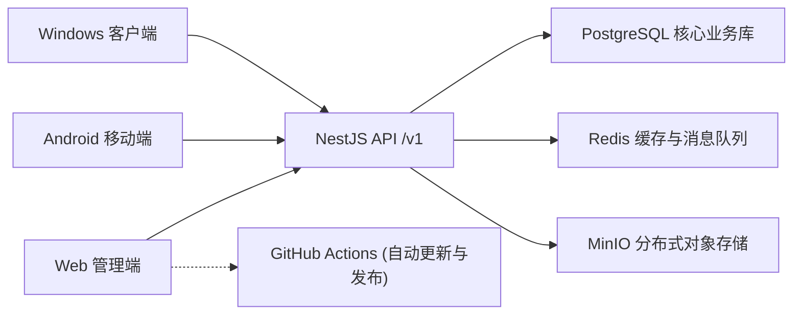

# W-Light 文旅灯光运维一体化平台

W-Light 是面向文旅灯光项目的专业级运维管控平台，致力于将工单流转、设备台账、备件库存、巡检管理、维修台账、数据报表和灯光师专业工具箱统一于一套云端协同系统中，并提供 Web 管理端、Android 移动端和 Windows 桌面客户端，实现全平台数据无缝互通。

## 系统架构



## 核心功能模块

- **工单流转引擎**：支持报修、派单、接单、挂起、维修记录提报、备件扣减、验收归档的完整闭环。
- **资产与设备台账**：支持项目级设备唯一约束、二维码标签生成、维修历史全生命周期追溯。
- **备件库存管理**：提供严格的入库、出库管控，维修记录与库存扣减强事务绑定。
- **自动化巡检管理**：支持自定义周期计划，发现异常项将自动触发并生成维修工单。
- **多维数据报表**：提供运营汇总、故障趋势、设备状态、备件消耗排行等可视化图表及 Excel 导出。
- **专业灯光工具箱**：内置 DMX 计算、功率计算、BPM 检测、LTC 时间码计算、光束角、RGB/色温转换等专业运维辅助工具。

## 平台支持与持续交付 (CI/CD)

本项目已接入 GitHub Actions 自动化流水线，实现提交即发布的持续交付体验：

- **Web 管理端 / PWA**：支持任何主流浏览器，可作为 PWA 直接安装至桌面。
- **Windows 桌面客户端**：基于 Electron 打包，适合调度室和项目管理电脑长期使用。流水线将自动构建 `.exe` 并发布至 GitHub Releases，Web 端提供一键直达下载。
- **Android 移动端**：基于 React Native 开发，专为现场维修人员设计，支持扫码、拍照上传和离线/弱网操作。流水线自动构建 `.apk` 并发布至 GitHub Releases。

*(注：为降低运维与签名分发成本，本项目目前专注支持 Windows 和 Android 平台，暂不分发 iOS 原生客户端。)*

## 生产环境部署指南

推荐使用 Ubuntu/Debian 服务器进行生产部署，最低配置可支持 1C1G（包含自动 Swap 策略），默认通过 Docker Compose 一键拉起所有微服务。

### 1. 一键部署系统

```bash
git clone https://github.com/tony-wang1990/W-Light.git /root/W-Light
cd /root/W-Light
bash scripts/server-deploy.sh --port 3005
```

### 2. 初始化高权限管理员账号

```bash
cd /root/W-Light
bash scripts/server-admin.sh --phone 13800000001 --password '你的强密码'
```

### 3. 生产环境自检与监控

系统内置了全面的健康检查与冒烟测试脚本，用于快速验证微服务连通性：

```bash
# 检查容器、资源及日志状态
bash scripts/server-health.sh --port 3005

# 模拟真实账号登录并执行全业务链 API 测试
bash scripts/server-smoke.sh --base-url http://127.0.0.1:3005 --phone 13800000001 --password '你的强密码'
```

### 4. 自动化灾备与恢复

整机备份脚本会自动备份 PostgreSQL、MinIO 附件快照以及 `.env` 环境变量，并生成 SHA256 校验清单防篡改。

- **执行单次备份**：`bash scripts/server-backup.sh`
- **配置自动化定时备份**（例：每日凌晨 3:15 备份，保留最近 14 份）：
  ```bash
  bash scripts/server-backup.sh --install-cron --cron "15 3 * * *" --keep 14
  ```

---

## 🚀 上线前必须完成的生产验收工序

为保障生产系统稳定与数据安全，在将系统正式移交实际业务团队使用前，请务必核对并完成以下关键工序：

### 第一阶段：安全与网络加固
- [ ] **配置 HTTPS 与反向代理**：严禁在公网使用 HTTP 明文传输。必须在 Nginx 或网关层配置 SSL 证书，将 Web、APP 和客户端的 API 地址统一指向 `https://你的域名/v1`。
- [ ] **重置安全凭证**：停用或修改默认创建的管理员账号与密码。
- [ ] **校验密钥安全**：确保生产环境的 `.env` 文件中使用了高强度的 `JWT_SECRET`，且绝对未将含有真实密码的 `.env` 文件泄露或推送至代码仓库。

### 第二阶段：沙盘推演与流程验收
- [ ] **全端工单闭环验收**：由测试人员使用 Android 真机进行一次完整的“扫码报修 -> 平台派单 -> 手机接单 -> 拍照上传维修记录 -> 备件扣减 -> 验收归档”全链路闭环测试。
- [ ] **弱网容灾验收**：在网络信号差的环境下测试 Android 移动端的图片上传与状态同步能力。
- [ ] **权限矩阵复核**：建立多级账号并交叉验证。确保“工程师”角色无法越权审批工单，“查看员”角色绝对无法执行备件入库及系统设置操作。

### 第三阶段：灾备演练
- [ ] **数据恢复演练**：在正式导入业务数据并对外服务前，必须人为制造一次“删库”故障，随后使用自动化备份脚本执行一次完整的恢复（Restore）演练，确认所有数据和附件能够 100% 找回。
