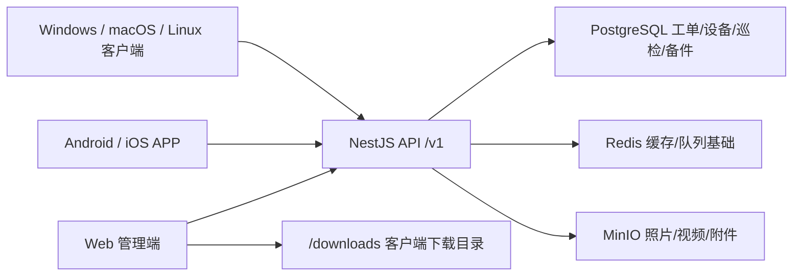

# W-Light 文旅灯光运维一体化平台

W-Light 是面向文旅灯光项目的运维平台，目标是把工单闭环、设备台账、备件库存、巡检管理、维修台账、报表数据和灯光师工具箱统一到一套云端系统里，并提供 Web、手机 APP 和桌面客户端。

当前版本：`0.9.0-internal.0`

当前状态：**可部署内测，正在生产加固和真实设备验收阶段。**

这不是最终生产版。后端、Web 管理端、Android APK、Windows 安装包和主要业务接口已经具备内测能力；iOS、macOS、Linux 客户端仍需要对应平台打包、签名和真机安装验收；正式上线前还必须完成 HTTPS、备份恢复演练、权限矩阵复核、真机/真实服务器全流程验收。

## 一句话结论

- 服务器：支持 Ubuntu/Debian、ARM64 和 AMD64，默认 `3005` 端口，Docker Compose 一键部署。
- Web 管理端：已接入项目、工单、维修台账、设备、备件、巡检、报表、用户、工具箱、客户端下载中心。
- 后端 API：NestJS + PostgreSQL + Redis + MinIO，核心并发/事务/分页/迁移问题已修复。
- Android APP：已有 React Native 原生工程和内测 APK 打包能力，本地下载目录已有 APK 产物；仍需真机验收和正式 keystore 签名。
- iOS APP：代码和脚本已具备，必须在 macOS + Xcode + Apple Developer 环境打包签名。
- Windows 客户端：已有 Electron 安装包打包能力，本地下载目录已有 Windows EXE 产物；仍需干净 Windows 机器安装验收和正式代码签名。
- macOS/Linux 客户端：打包入口已具备，需要在对应系统构建、签名/公证和安装验收。
- 自动化质量：后端 11 个测试套件 42 个用例；Web Vitest 和 Playwright 已覆盖关键菜单与工单 UI 闭环；后端/Web/手机端 lint 已清到 0 warning；GitHub Actions CI 已接入。

## 项目架构



所有客户端只要填写同一个 API 地址，例如：

```text
http://服务器IP:3005/v1
https://你的域名/v1
```

数据就会同步到同一套 PostgreSQL/MinIO。Web、Android、iOS、Windows、macOS、Linux 不是各自一套数据。

## 当前功能状态

| 模块 | 当前状态 | 说明 |
| --- | --- | --- |
| 服务器部署 | 已具备内测部署能力 | 支持 ARM64/AMD64、1C1G 小服务器、自动 swap、Docker Compose、默认 3005 端口 |
| 后端 API | 已进入内测 | 已覆盖认证、项目、用户、工单、设备、备件、巡检、报表、上传、健康检查 |
| Web 管理端 | 已进入内测 | 主要菜单已接入真实 API，已修复多个菜单 500、空白和工单交互问题 |
| 工单闭环 | 已具备基础闭环 | 创建、派单、接单、拒单、挂起、恢复、维修记录、扣减备件、提交验收、验收归档 |
| 设备台账 | 已具备基础能力 | 新增、编辑、删除、搜索、二维码标签、详情展示、项目级唯一约束 |
| 备件库存 | 已具备基础能力 | 入库/出库原子更新，维修记录扣减备件已纳入事务 |
| 巡检管理 | 已具备基础能力 | 巡检计划、巡检记录、异常生成工单已接入，仍需现场流程验收 |
| 报表与数据 | 已具备基础能力 | 运营汇总、周趋势、设备状态、备件排行、Excel 导出、项目 JSON 备份/恢复预检 |
| 灯光师工具箱 | 已具备基础页面 | DMX、功率、BPM、LTC、光束角、照度、RGB/色温、故障诊断、MA 宏、术语、灯库等 |
| Android APP | 可打内测 APK | 需要真机安装、扫码、拍照上传、弱网、离线队列验收 |
| iOS APP | 代码已具备 | 需要 macOS/Xcode/Apple 签名环境生成 IPA 或 TestFlight |
| Windows 客户端 | 可打 EXE | 需要干净 Windows 机器安装/卸载/登录验收，正式分发需代码签名 |
| macOS 客户端 | 打包入口已具备 | 需要 macOS 打包、Developer ID 签名和公证 |
| Linux 客户端 | 打包入口已具备 | 需要 Linux 构建 AppImage 并运行验收 |
| 测试与 CI | 已接入 | CI 会跑后端、Web、工具箱、手机端类型检查、Playwright 和 PostgreSQL e2e |

## 已重点修复的问题

- 工单号不再用 `count + 1`，避免并发重复和删除后序号回退。
- 备件入库/出库使用数据库原子更新，维修记录和备件扣减放入同一事务。
- 报表月末日期计算已修复，避免 JavaScript 月份溢出。
- PostgreSQL uuid/varchar 关联导致的报表、工单、巡检 500 已修复。
- TypeORM 分页排序触发的 `databaseName` 异常已修复。
- Web 工单派单/接单/维修记录/验收归档 UI 已有 Playwright 回归测试。
- 上传限制已配置：图片 10MB，视频 100MB，且限定 MIME 类型。
- MinIO 不对公网暴露，附件访问通过后端 JWT + 项目权限校验。
- 真实 `.env` / `.env.*` 不进入 Git，仓库只保留 `.env.development.example`。

## 目录结构

```text
services/backend/        NestJS 后端 API、TypeORM entity/migration/test
apps/web/                React + Vite Web 管理端，也是桌面客户端内容源
apps/LightOps/           React Native 手机 APP，包含 Android/iOS 原生工程
apps/desktop/            Electron 桌面客户端
packages/toolbox-core/   灯光工具箱计算核心
scripts/                 部署、备份、管理员、客户端打包、校验脚本
deploy/downloads/        Web 容器挂载的客户端下载目录
```

## 服务器部署

支持 Ubuntu/Debian，ARM64 和 AMD64 都可以。默认 Web 端口是 `3005`。

### 一键部署

```bash
git clone https://github.com/tony-wang1990/W-Light.git /root/W-Light
cd /root/W-Light
bash scripts/server-deploy.sh --port 3005
```

部署完成后创建或重置管理员：

```bash
cd /root/W-Light
bash scripts/server-admin.sh --phone 13800000001 --password 'WLight@2026'
```

访问地址：

```text
Web 管理端：http://服务器IP:3005
API 健康检查：http://服务器IP:3005/v1/health
客户端下载中心：http://服务器IP:3005/clients
静态下载目录：http://服务器IP:3005/downloads/
```

登录页填写：

```text
Web 同源登录：/v1
手机 APP / 桌面客户端：http://服务器IP:3005/v1
```

云服务器必须在安全组/防火墙放行 TCP `3005`。正式上线建议配置域名和 HTTPS，然后统一使用：

```text
https://你的域名/v1
```

### 服务器更新

推荐使用带备份、健康检查和失败回滚的升级脚本：

```bash
cd /root/W-Light
bash scripts/server-upgrade.sh --branch main --port 3005
```

部署或升级后执行自检：

```bash
cd /root/W-Light
bash scripts/server-health.sh --port 3005
bash scripts/server-smoke.sh --base-url http://服务器IP:3005 --phone 13800000001 --password '你的管理员密码'
```

`server-health.sh` 看容器、资源、日志和备份；`server-smoke.sh` 会真实登录，并请求工单、设备、备件、巡检、报表、用户等关键 API。

### 常用排障

```bash
cd /root/W-Light
docker compose ps
docker compose logs --tail=120 api
docker compose logs --tail=120 web
curl -i http://127.0.0.1:3005/v1/health
git rev-parse --short HEAD
```

## 备份与恢复

整机备份脚本会备份 PostgreSQL、MinIO 附件和 `.env` 快照，并生成 SHA256 校验清单。

```bash
cd /root/W-Light
bash scripts/server-backup.sh
```

查看、校验、恢复：

```bash
bash scripts/server-backup.sh --list
bash scripts/server-backup.sh --verify /root/W-Light/deploy/backups/20260603-120000
bash scripts/server-backup.sh --restore /root/W-Light/deploy/backups/20260603-120000 --yes
```

安装每日定时备份，例如每天 3:15，保留最近 14 份：

```bash
bash scripts/server-backup.sh --install-cron --cron "15 3 * * *" --keep 14
crontab -l
```

正式上线前必须至少做一次备份和恢复演练。

## 客户端状态与下载方式

部署后可以打开：

```text
http://服务器IP:3005/clients
http://服务器IP:3005/downloads/
```

注意：`deploy/downloads/` 里的 APK/EXE/DMG/AppImage/IPA 等大安装包默认不进入 Git。也就是说，服务器 `git pull` 后不会自动得到本地电脑已经生成的安装包。需要在服务器上打包，或把本地打好的文件上传到服务器的 `/root/W-Light/deploy/downloads/`。

### 客户端矩阵

| 平台 | 当前状态 | 下载/安装方式 | 还缺什么 |
| --- | --- | --- | --- |
| Web 浏览器 | 可用内测 | 打开 `http://服务器IP:3005` | HTTPS、真实菜单逐项验收 |
| Android APP | 有内测 APK 产物和打包脚本 | `http://服务器IP:3005/downloads/w-light-latest.apk` | 真机安装、扫码、拍照上传、弱网/离线验收，正式 keystore 签名 |
| iOS APP | 代码和脚本具备 | 需要 macOS/Xcode Archive，TestFlight/Ad Hoc/企业签名分发 | 签名打包、真机或 TestFlight 验收 |
| Windows 客户端 | 有 EXE 打包能力和本地内测产物 | `http://服务器IP:3005/downloads/W-Light-Setup-latest.exe` | 干净机器安装/卸载/升级验收，代码签名 |
| macOS 客户端 | 打包入口具备 | `W-Light-latest.dmg`，需 macOS 构建后发布 | Developer ID 签名、公证、Intel/Apple Silicon 验收 |
| Linux 客户端 | 打包入口具备 | `W-Light-latest.AppImage`，需 Linux 构建后发布 | AppImage 运行验收 |

下载页会自动检测安装包是否存在。未发布的平台会显示“暂未发布”，避免用户点到 404。

### Android 打包

前置条件：JDK 17、Android SDK、`ANDROID_HOME`。正式发布建议配置 release keystore；未配置时会回退 debug 签名，仅适合内部测试。

Linux/macOS/WSL：

```bash
corepack pnpm android:release
corepack pnpm android:release:publish
```

Windows PowerShell：

```powershell
powershell -ExecutionPolicy Bypass -File scripts/android-release.ps1
powershell -ExecutionPolicy Bypass -File scripts/android-release.ps1 -PublishWeb
```

校验下载产物：

```bash
corepack pnpm downloads:verify -- --strict
```

### iOS 打包

iOS 必须在 macOS + Xcode + Apple Developer 签名环境完成。

```bash
cd apps/LightOps/ios
pod install
open LightOps.xcworkspace
```

在 Xcode 中配置 Team、Bundle Identifier、Release Scheme，然后 Archive，走 TestFlight、Ad Hoc、企业签名或 MDM 分发。

### Windows 桌面端打包

```powershell
powershell -ExecutionPolicy Bypass -File scripts/desktop-release.ps1 -Target win -PublishWeb
```

### macOS / Linux 桌面端打包

```bash
bash scripts/desktop-release.sh --mac --publish-web
bash scripts/desktop-release.sh --linux --publish-web
```

## 本地开发

```bash
corepack enable
corepack pnpm install --frozen-lockfile
```

可选：使用本地 SQLite 开发后端。

```bash
cp services/backend/.env.development.example services/backend/.env.development
```

Windows PowerShell：

```powershell
Copy-Item services/backend/.env.development.example services/backend/.env.development
```

常用命令：

```bash
corepack pnpm --filter backend run test
corepack pnpm --filter backend run build
corepack pnpm --filter web run test
corepack pnpm --filter web run test:e2e
corepack pnpm --filter web run build
corepack pnpm --filter LightOps run typecheck
corepack pnpm --filter LightOps run lint
corepack pnpm --filter @lightops/toolbox-core run test
corepack pnpm downloads:verify -- --strict
```

后端 PostgreSQL e2e：

```bash
corepack pnpm run test:backend:postgres-e2e
```

需要 Docker。

## 自动化测试与 CI

GitHub Actions 已接入：

- shell 脚本语法检查。
- 后端 lint/test/build。
- 后端 PostgreSQL e2e。
- Web Vitest、Vite build、Playwright e2e。
- 手机端 TypeScript typecheck。
- 工具箱核心库测试和构建。

本地最近验证状态：

```text
backend test：11 suites / 42 tests passed
web test：11 tests passed
web Playwright：关键菜单 + 工单 UI 闭环通过
web build：通过，无 500k 大包警告
backend/web/mobile lint：0 warning
downloads verify strict：Android APK + Windows EXE 校验通过
```

CI 不能替代真实手机、真实 Windows/Mac、真实服务器和真实控台设备验收。

## 未完成或仍需验收的功能

### 服务器与安全

- 配置正式域名、HTTPS 和反向代理。
- 生产服务器执行一次 `server-smoke.sh` 业务自检。
- 生产服务器执行一次备份、校验、恢复和升级回滚演练。
- 配置定时备份、磁盘空间监控、日志保留和告警。
- 修改默认管理员密码，确认 `.env` 强随机密钥。
- 根据真实组织结构复核管理员、工程师、巡检员、查看员权限矩阵。

### Web 管理端

- 多项目场景下验证项目切换不串数据。
- 非管理员只能访问授权项目的真实场景验收。
- 工单真实流程验收：报修 -> 派单 -> 接单 -> 维修记录 -> 扣减备件 -> 提交验收 -> 验收归档。
- 工程师不能操作非本人负责工单的真实权限验收。
- 维修台账搜索、维修过程展示、Excel 导出中文列名验收。
- 设备详情维修历史、发起报修、批量导入格式和错误报告验收。
- 巡检计划的每日/每周/每月周期、异常自动生成工单、巡检员权限验收。
- 报表在无数据、有数据、多项目场景下逐项验收。
- JSON 备份恢复预检和恢复流程验收。

### 工具箱

- 各工具输入边界、空值、极值和移动端显示验收。
- BPM 音频文件自动识别尚未作为生产功能交付。
- LTC 生成结果需要用真实控台或音频工具验证兼容性。
- 灯库制作导出格式需要用真实控台软件导入验证。

### 手机端

- Android 真机安装和登录真实服务器验收。
- Android 扫码、拍照上传、附件访问权限验收。
- Android 弱网、断网、离线队列和恢复同步验收。
- iOS 签名打包、TestFlight 或真机安装验收。
- 手机端离线工具箱逐项验收。

### 桌面端

- Windows 安装包在干净机器安装、登录、覆盖安装和卸载验收。
- Windows 正式代码签名。
- macOS DMG 打包、签名、公证和 Gatekeeper 流程验收。
- Linux AppImage 运行验收。
- 桌面端 API 地址配置、退出登录、缓存清理验收。

## 上线前必须完成的工序

1. 在真实服务器部署最新代码，执行 `server-health.sh` 和 `server-smoke.sh`。
2. 配置域名 HTTPS，把 Web、手机 APP、桌面客户端 API 地址统一到 `https://域名/v1`。
3. 创建正式管理员账号，停用或修改默认密码。
4. 完成生产备份、恢复、定时备份和升级回滚演练。
5. 使用真实项目数据逐菜单验收 Web 管理端。
6. Android 真机安装并跑通扫码、拍照、上传、工单闭环和离线同步。
7. Windows 干净机器安装并跑通登录、工单、报表、退出登录和卸载。
8. 完成 iOS、macOS、Linux 对应平台打包和安装验收。
9. 完成 Windows/macOS/iOS 正式签名方案。
10. 根据现场人员组织复核权限矩阵。
11. 标记内部验收版本，例如 `v0.9.0-internal.0`。
12. 整理已知问题和运维手册，进入小范围试运行。

## 重要文档

- [PRODUCTION_ACCEPTANCE.md](PRODUCTION_ACCEPTANCE.md)：完整生产验收清单和阶段记录。
- [MOBILE_APP_GUIDE.md](MOBILE_APP_GUIDE.md)：手机 APP 打包、安装和使用指南。
- [MOBILE_RELEASE_CHECKLIST.md](MOBILE_RELEASE_CHECKLIST.md)：移动端发布验收清单。
- [DESKTOP_CLIENT_GUIDE.md](DESKTOP_CLIENT_GUIDE.md)：桌面客户端打包与安装指南。
- [DESKTOP_RELEASE_CHECKLIST.md](DESKTOP_RELEASE_CHECKLIST.md)：桌面客户端发布验收清单。
- [CLIENT_RELEASE_MATRIX.md](CLIENT_RELEASE_MATRIX.md)：全端客户端发布矩阵。
- [RELEASE.md](RELEASE.md)：发布流程。
- [CHANGELOG.md](CHANGELOG.md)：版本记录。
- [ORACLE_ARM_DEPLOY.md](ORACLE_ARM_DEPLOY.md)：Oracle ARM / AMD 服务器部署说明。
- [FULL_CODE_AUDIT_REPORT.md](FULL_CODE_AUDIT_REPORT.md)：全代码审计报告。
