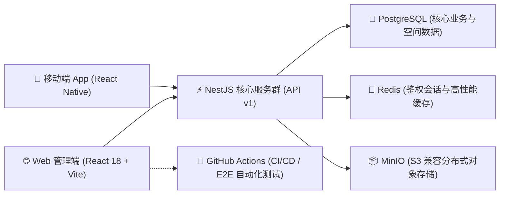

# W-Light 文旅灯光运维一体化平台

W-Light 是一款专为**大型文旅夜游、实景演艺及商业照明项目**量身定制的专业级运维管控平台。系统致力于将分散的工单流转、设备台账、备件仓储、巡检管理、多维数据分析以及专业灯光调试工具统一于一套高度协同的云端业务闭环中。

本平台提供强大的 **Web 管理后台**（PC）与便捷的 **移动端 App**（Android），并在架构设计上严格贯彻**多租户/多项目数据隔离**与 **RBAC 角色鉴权**，实现从报修发起到数据核算的全链路业务数字化。

## 🌟 核心业务架构与特性 (Phase 1)

### 1. 深度协同的工单流转引擎 (Work Order Engine)
- **全生命周期追踪**：支持从现场扫码报修、系统智能派单、工程师抢接单、维修过程记录（图文）、到终端验收归档的完整状态机流转。
- **SLA 监控与预警**：内置工单超时（Overtime）跟踪机制，帮助管理者实时监控卡点，把控维修时效。
- **维修日志与物料强绑定**：维修过程中的物料核销直接与库房台账联动，杜绝备件去向不明。

### 2. 精密资产与仓储管理 (Assets & Inventory)
- **多维度设备台账**：支持项目级设备唯一编码、分类、品牌型号记录，追踪维保期限及全生命周期维修历史，并支持地图坐标（GIS）可视化定位。
- **动态备件库与水位预警**：严格管控出入库行为，系统实时计算当前库存并在触及“安全警戒线（Minimum Stock）”时在仪表盘自动推送预警。

### 3. 自动化巡检与多层权限体系 (Inspection & RBAC)
- **自动化防漏巡检**：通过制定周期性巡检计划，发现异常即刻转换为处理工单。
- **RBAC 精细化控权**：严格区分系统管理员（Admin）、维修工程师（Engineer）、巡检员（Inspector）和只读访客（Viewer）。数据视图与操作按钮将根据账号角色（包括 App 端底部导航）智能动态渲染或隐藏。

### 4. 专业灯光师随身工具箱 (Pro Toolbox)
- 内置大量专为灯光行业定制的小工具：DMX 拨码计算、功率负载评估、BPM / LTC 时间码检测换算、光束角计算以及色温坐标转换，帮助工程师抛弃纸笔，现场快速定位问题。

---

## 🔥 最新重大架构升级 (Phase 2)

在近期的深度优化迭代中，我们对 W-Light 的底层性能与极限环境下的业务可用性进行了脱胎换骨的升级：

### 1. Web端实时状态推送架构 (SSE Real-time Dashboard)
彻底淘汰了落后的手动刷新机制。Web 端工单看板已接入 **Server-Sent Events (SSE) 实时数据流**。无论是现场工程师抢单、提交报修，还是后台管理员派单，大屏状态均能实现**毫秒级无感同步刷新**。

### 2. 移动端弱网离线队列架构 (Offline Mutation Queue)
专为剧场地下室、偏远外景等信号盲区设计。当工程师在断网或弱网环境下**提交维修日志、消耗备件、甚至上传实景故障照片**时，系统底层引擎（Zustand + MMKV secureStorage）会自动接管，将操作及附件**加密暂存入沙箱队列**。当侦测到手机重新接入网络（4G/WIFI）的瞬间，驻留后台的“网络嗅探哨兵”将被唤醒，静默完成所有历史记录的重发同步，**数据彻底零丢失**。

### 3. 数据层极速检索引擎优化 (Database Indexing)
随着历史数据不断沉淀，系统已完成全库高频核心查询链路的 `B-Tree` / `Hash` 复合索引覆盖，包括工单状态流、物料库存明细等核心业务表结构。确保即使应对海量百万级数据查询，系统响应时间仍稳若磐石。

### 4. 统一的一站式数据下载中心 (Unified Data Export)
我们在 Web 管理端开辟了全新的**「数据下载中心」**模块，告别过去分散各页面的零散数据。您只需设定月份/日期范围，即可一键将业务数据一网打尽：
- 📊 **月度统计报表**：备件消耗明细表、人员绩效考核表、月度统计故障表、月度工单明细表 (皆为开箱即用的 Excel 模板)。
- 📁 **基石台账明细**：设备台账总表、备件库存总表 (Excel)。
- 📑 **高管汇报专用**：一键生成自带图表分析与业务总结的精美排版 **PDF 月度综合运营报告**。

---

## 🛠️ 技术栈与系统架构

W-Light 采用现代化的全栈微服务架构设计，确保系统在高频并发与复杂查询场景下依然保持强劲的性能：



---

## 🚀 生产环境部署指南

推荐使用 Ubuntu/Debian 服务器进行生产部署，最低配置可支持 1C1G（内置自动 Swap 优化策略），通过 Docker Compose 实现五大组件（App, API, DB, Cache, Storage）一键拉起。

### 1. 一键部署系统

```bash
git clone https://github.com/tony-wang1990/W-Light.git /root/W-Light
cd /root/W-Light
bash scripts/server-deploy.sh --port 3005
```

### 2. 初始化最高权限超级管理员账号

```bash
cd /root/W-Light
bash scripts/server-admin.sh --phone 13800000001 --password '你的强密码'
```

### 3. 自动化灾备与全量恢复

系统提供整机级别的沙箱备份脚本，自动打包 PostgreSQL 数据、MinIO 附件快照以及 `.env` 环境变量，并生成 SHA256 校验清单防篡改。

- **执行单次全量备份**：`bash scripts/server-backup.sh`
- **配置自动化定时备份**（例：每日凌晨 3:15 备份，自动滚动保留最近 14 份）：
  ```bash
  bash scripts/server-backup.sh --install-cron --cron "15 3 * * *" --keep 14
  ```

---

## 🛡️ 上线前生产验收工序 (Checklist)

为保障生产系统稳定与业务数据安全，在将系统正式移交实际业务团队运行前，请务必严格核对以下关键环节：

### 第一阶段：安全与网络加固
- [ ] **配置 HTTPS 与反向代理**：严禁在公网环境使用 HTTP 明文传输 API 或页面。必须在 Nginx 或云端网关层配置 SSL 证书，将 Web、APP 和客户端的 API 地址统一加密传输。
- [ ] **重置安全凭证**：停用或修改默认创建的测试管理员账号与密码。
- [ ] **校验密钥防渗透**：确保生产环境的 `.env` 文件中配置了高强度的 `JWT_SECRET`，且**绝对不能**将含有真实密码的 `.env` 文件泄露或推送至公有代码仓库。

### 第二阶段：沙盘推演与弱网演练
- [ ] **全端工单闭环验收**：由测试工程师使用 Android 真机进行一次完整的“扫码报修 -> 平台智能派单 -> 手机接单响应 -> 拍照上传现场 -> 备件核销扣减 -> 完工验收归档”全链路穿越测试。
- [ ] **弱网抢通压力测试**：在进行上述演练时，尝试在“手机接单响应”环节切断手机网络，验证「移动端弱网离线队列」沙箱拦截与重发能力。
- [ ] **权限隔离矩阵复核**：建立多层级账号并交叉验证边界。确保“工程师”角色无法越权审批非本人工单，且“巡检员”角色无法查阅“库房与设备台账”。
