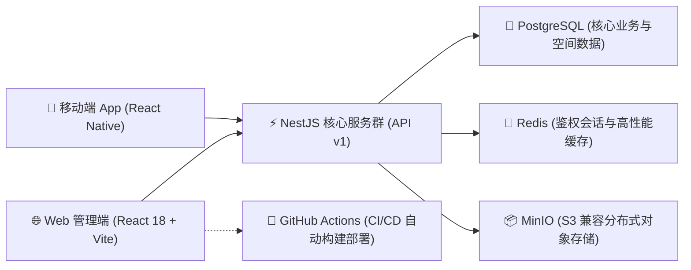

# W-Light 文旅灯光运维一体化平台

W-Light 是一款专为**大型文旅夜游、实景演艺及商业照明项目**量身定制的专业级运维管控平台。系统致力于将分散的工单流转、设备台账、备件仓储、巡检管理、多维数据分析以及专业灯光调试工具统一于一套高度协同的云端业务闭环中。

本平台提供强大的 **Web 管理后台**（PC）与便捷的 **移动端 App**（Android），并在架构设计上严格贯彻**多租户/多项目数据隔离**与 **RBAC 角色鉴权**，实现从报修发起到数据核算的全链路业务数字化。

## 🌟 核心业务架构与特性

### 1. 深度协同的工单流转引擎 (Work Order Engine)
- **全生命周期追踪**：支持从现场扫码报修、系统智能派单、工程师抢接单、维修过程记录（图文）、到终端验收归档的完整状态机流转。
- **SLA 监控与预警**：内置工单超时（Overtime）跟踪机制，帮助管理者实时监控卡点，把控维修时效。
- **维修日志与物料强绑定**：维修过程中的物料核销直接与库房台账联动，杜绝备件去向不明。

### 2. 精密资产与仓储管理 (Assets & Inventory)
- **多维度设备台账**：支持项目级设备唯一编码、分类、品牌型号记录，追踪维保期限及全生命周期维修历史，并支持地图坐标（GIS）可视化定位。
- **动态备件库与水位预警**：严格管控出入库行为，系统实时计算当前库存并在触及“安全警戒线（Minimum Stock）”时在仪表盘自动推送预警。

### 3. 数据驱动的下载与报表中心 (Data Download Center)
彻底告别手工账，平台内置专属【数据下载中心】，提供一键生成 6 大深度耦合的业务报表供业务复盘与对账：
1. **备件消耗明细表 (Excel)**：精准追踪每一颗灯泡的具体去向（哪天、哪个单、什么设备、什么故障、谁领的、花了多少钱）。
2. **工程师绩效考核表 (Excel)**：实时核算每位员工的按期完工率、平均修复时长（MTTR）及累计产生的维修物料成本。
3. **工单处理汇总表 (Excel)**：沉淀详尽的报修、派发、闭环时间戳记录大全。
4. **设备台账 / 备品库存明细 (Excel)**：支持定期盘点与底表导出。
5. **故障统计分析表 (Excel)**：分析各类故障的发生频次与消耗成本占比。
6. **月度运维综合报告 (PDF)**：一键生成排版精美的多维月度运营总结报告。

### 4. 自动化巡检与多层权限体系 (Inspection & RBAC)
- **自动化防漏巡检**：通过制定周期性巡检计划，发现异常即刻转换为处理工单。
- **RBAC 精细化控权**：严格区分系统管理员（Admin）、维修工程师（Engineer）、巡检员（Inspector）和只读访客（Viewer）。数据视图与操作按钮将根据账号角色（包括 App 端底部导航）智能动态渲染或隐藏。

### 5. 专业灯光师随身工具箱 (Pro Toolbox)
内置大量专为灯光行业定制的小工具：DMX 拨码计算、功率负载评估、BPM / LTC 时间码检测换算、光束角计算以及色温坐标转换，帮助工程师抛弃纸笔，现场快速定位问题。

---

## 🛠️ 技术栈与系统架构

W-Light 采用现代化的全栈微服务架构设计，确保系统在高频并发与复杂查询场景下依然保持强劲的性能：



---

## 🚀 生产环境部署指南

推荐使用 Ubuntu/Debian 服务器进行生产部署，最低配置可支持 1C1G（内置自动 Swap 优化策略），通过 Docker Compose 实现五大组件（App, API, DB, Cache, Storage）一键拉起。

### 1. 一键部署系统

```bash
git clone https://github.com/tony-wang1990/W-Light.git /root/W-Light
cd /root/W-Light
bash scripts/server-deploy.sh --port 3005
```

### 2. 初始化最高权限超级管理员账号

```bash
cd /root/W-Light
bash scripts/server-admin.sh --phone 13800000001 --password '你的强密码'
```

### 3. 生产环境自检与监控

系统内置了全面的健康检查与全链路冒烟测试脚本，用于快速验证微服务连通性：

```bash
# 检查容器、资源及日志状态
bash scripts/server-health.sh --port 3005

# 模拟真实账号登录并执行核心业务链路连通性测试
bash scripts/server-smoke.sh --base-url http://127.0.0.1:3005 --phone 13800000001 --password '你的强密码'
```

### 4. 自动化灾备与全量恢复

系统提供整机级别的沙箱备份脚本，自动打包 PostgreSQL 数据、MinIO 附件快照以及 `.env` 环境变量，并生成 SHA256 校验清单防篡改。

- **执行单次全量备份**：`bash scripts/server-backup.sh`
- **配置自动化定时备份**（例：每日凌晨 3:15 备份，自动滚动保留最近 14 份）：
  ```bash
  bash scripts/server-backup.sh --install-cron --cron "15 3 * * *" --keep 14
  ```

---

## 🛡️ 上线前生产验收工序 (Checklist)

为保障生产系统稳定与业务数据安全，在将系统正式移交实际业务团队运行前，请务必严格核对以下关键环节：

### 第一阶段：安全与网络加固
- [ ] **配置 HTTPS 与反向代理**：严禁在公网环境使用 HTTP 明文传输 API 或页面。必须在 Nginx 或云端网关层配置 SSL 证书，将 Web、APP 和客户端的 API 地址统一加密传输。
- [ ] **重置安全凭证**：停用或修改默认创建的测试管理员账号与密码。
- [ ] **校验密钥防渗透**：确保生产环境的 `.env` 文件中配置了高强度的 `JWT_SECRET`，且**绝对不能**将含有真实密码的 `.env` 文件泄露或推送至公有代码仓库。

### 第二阶段：沙盘推演与流程验收
- [ ] **全端工单闭环验收**：由测试工程师使用 Android 真机进行一次完整的“扫码报修 -> 平台智能派单 -> 手机接单响应 -> 拍照上传现场 -> 备件核销扣减 -> 完工验收归档”全链路穿越测试。
- [ ] **权限隔离矩阵复核**：建立多层级账号（管理员、工程师、巡检员）并交叉验证边界。确保“工程师”角色无法越权审批非本人工单，且“巡检员”角色在移动端及 Web 端绝对无法查阅及操作“库房与设备台账”。

### 第三阶段：终极灾备演练
- [ ] **灾备全量恢复演练**：在正式导入海量真实业务数据前，必须人为制造一次“删库跑路”故障，随后使用自动化备份包（`.tar.gz`）执行一次强制数据回滚恢复（Restore）演练，确认系统能毫发无损地找回所有数据及工单附件图片。
