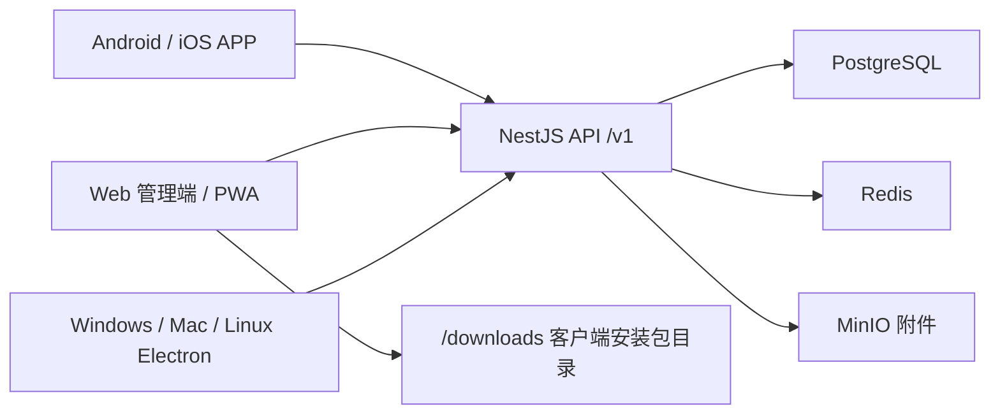

# W-Light 文旅灯光运维一体化平台

W-Light 是面向文旅灯光项目的运维闭环和灯光师工具箱系统。项目采用 Monorepo 管理，包含云端后端、Web 管理端、React Native 手机 APP、Electron 桌面客户端和共享工具核心库。

当前代码基线：2026-06-07。

## 当前真实状态

### 已实装的业务范围

- 工单闭环：报修、派单、接单、拒单、挂起、恢复、维修记录、备件消耗、提交验收、验收通过/驳回、取消、归档查询。
- 设备台账：设备增改查删、二维码/设备编号扫码查询、项目内设备编号和二维码唯一约束、设备详情到报修/维修历史联动。
- 备件库存：入库、出库、低库存预警、出入库记录、工单维修记录中联动扣减备件。
- 巡检管理：巡检计划、今日计划、巡检记录、异常巡检自动生成维修工单。
- 报表与数据：运营汇总、周趋势、设备状态、备件消耗排行、工单 Excel 导出、项目 JSON 备份与恢复预检/恢复。
- 用户与权限：登录、刷新 token、用户增改禁用、角色、项目隔离、维修人员工作量查询。
- 通知中心：手机端未读角标、通知列表、单条已读、全部已读、通知跳转关联工单。
- 专业工具箱：DMX 地址、功率负荷、光束角、照度、RGB/色温、故障诊断、MA 宏命令、行业术语、LTC 时码、灯库制作、灯位设计、灯光理论。
- 客户端入口：Web 下载中心、静态 `/downloads/` 目录、Android/Windows/Mac/Linux/iOS 打包脚本入口。

### 本次收口确认过的关键逻辑

- 工单号不是按总数生成，已改为日序列表事务生成，避免并发冲突和删除后序号回退。
- 备件入库/出库使用数据库原子更新；工单维修记录和备件扣减在同一事务内执行，避免库存泄露。
- 报表按月份回退时已规避 JavaScript 月末日期溢出问题。
- Web 和手机端主业务 API 调用均能在后端找到对应路由；已修复用户 `role` 查询参数、通知分页返回格式、手机跨 Tab 跳转和设备历史假接口。

### 需要外部环境完成的上线项

这些不是代码菜单，而是正式交付前必须在真实环境完成的工作：

- Android APK/AAB：Windows 本机已验证可构建 `app-release.apk`，但生产分发仍需要正式签名证书和至少一台真机安装测试。
- iOS IPA/TestFlight：必须在 macOS + Xcode + Apple Developer 签名环境完成；未签名 IPA 不能直接装到 iPhone。
- Windows/Mac/Linux 桌面包：需要在目标平台构建并做安装测试；生产分发建议配置代码签名。
- 域名与 HTTPS：生产手机端建议使用 `https://your-domain.com/v1`，不要长期使用裸 IP + HTTP。
- 服务器验收：ARM64 和 AMD64 机器都要跑一次部署脚本、登录、创建工单、上传附件、导出 Excel、备份恢复预检。
- 运维保障：配置定时备份、日志留存、磁盘告警、容器健康监控和升级回滚流程。
- 高级工具增强：BPM 手动打拍已可用，音频文件自动 BPM 识别还没有作为生产功能交付。

### 本机已验证的客户端产物

- Windows：已在短路径构建目录成功生成 `deploy/downloads/W-Light-Setup-latest.exe` 和 SHA256。
- Android：已在 JDK 17 + Android SDK 环境成功生成 `deploy/downloads/w-light-latest.apk` 和 SHA256；当前未配置正式 keystore 时会使用 debug keystore 兜底签名，适合作为内测安装包，不等同于应用商店生产签名包。
- macOS / iOS：代码和脚本入口已准备，但必须在 macOS + Xcode + Apple Developer 签名环境生成可安装包。
- `deploy/downloads` 里的大安装包默认不提交到 Git。服务器要提供下载，需要把生成的 EXE/APK/DMG/IPA 上传到服务器仓库同名目录，或在服务器上重新运行打包脚本。

## 架构



## 目录结构

- `services/backend/`：NestJS 后端，PostgreSQL/Redis/MinIO，TypeORM migrations。
- `apps/web/`：React + Vite Web 管理端，同时作为 PWA 和 Electron 桌面端内容源。
- `apps/LightOps/`：React Native 手机 APP，包含 Android 和 iOS 原生工程。
- `apps/desktop/`：Electron 桌面客户端。
- `packages/toolbox-core/`：灯光工具箱纯计算逻辑。
- `scripts/`：服务器部署、备份、管理员重置、Android/iOS/桌面端打包脚本。
- `deploy/downloads/`：服务器 Web 容器挂载的客户端下载目录。

## Web 路由

- `/login`：登录控制台。
- `/dashboard`：运营概览、报表摘要、导出、备份。
- `/projects`：项目管理。
- `/orders`：工单调度中心。
- `/maintenance`：维修记录台账。
- `/devices`：设备台账管理。
- `/parts`：备件库存管理。
- `/inspections`：巡检计划和巡检记录。
- `/reports`：报表与数据导出。
- `/users`：用户权限管理。
- `/toolbox`：专业工具箱。
- `/clients`：客户端下载中心。

## 后端 API 映射

- `/v1/auth/*`：登录、刷新、当前用户、FCM token、退出。
- `/v1/projects/*`：项目创建、列表、详情、更新。
- `/v1/orders/*`：工单、状态流转、维修记录。
- `/v1/devices/*`：设备台账、扫码查询、批量导入。
- `/v1/parts/*`：备件、入库、出库、低库存、库存日志。
- `/v1/inspections/*`：巡检计划、今日计划、巡检记录、巡检统计。
- `/v1/reports/*`：统计、Excel 导出、备份、恢复。
- `/v1/users/*`：用户列表、创建、更新、禁用。
- `/v1/upload/*` 和 `/v1/files/*`：附件上传与鉴权访问。
- `/v1/notifications/*`：通知列表、未读数、已读。
- `/v1/health`：服务健康检查。

## 手机 APP 导航

- 首页：统计卡、通知、扫码查验、快捷报修、今日巡检提醒。
- 工单：列表筛选、详情、派单/接单、维修记录、验收。
- 台账：设备、备件、巡检入口，设备详情可直接报修或查看维修历史。
- 工具箱：13 个离线工具页面。
- 我的：账号信息、退出登录。

## 服务器一键部署

支持 Ubuntu/Debian 的 ARM64 和 AMD64 服务器，默认 Web 端口是 `3005`，适配 1C1G 小机器并自动创建 swap。

```bash
# 首次部署
git clone https://github.com/tony-wang1990/W-Light.git /root/W-Light
cd /root/W-Light
bash scripts/server-deploy.sh --port 3005

# 创建或重置管理员账号
bash scripts/server-admin.sh --phone 13800000001 --password 'WLight@2026'
```

部署完成后访问：

- Web：`http://服务器IP:3005`
- API：`http://服务器IP:3005/v1`
- 下载中心：`http://服务器IP:3005/downloads/`

登录填写：

- Web 同源登录页的服务器地址可以填 `/v1`，也可以填 `http://服务器IP:3005/v1`。
- 手机 APP 和桌面客户端首次登录建议填完整地址：`http://服务器IP:3005/v1`。
- 默认管理员示例：`13800000001` / `WLight@2026`，生产环境请立刻改强密码。

服务器如果页面打不开，优先检查：

```bash
cd /root/W-Light
docker compose ps
docker compose logs --tail=80 api
docker compose logs --tail=80 web
curl -i http://127.0.0.1:3005/v1/health
```

云服务器还需要在安全组/防火墙放行 TCP `3005`。绑定域名和 HTTPS 时，再放行 `80` 和 `443`。

## 服务器更新

```bash
cd /root/W-Light
git pull
bash scripts/server-deploy.sh --port 3005 --app-dir /root/W-Light
docker compose ps
```

如果只想重置管理员：

```bash
cd /root/W-Light
bash scripts/server-admin.sh --phone 13800000001 --password 'NewStrongPassword123'
```

## 备份与恢复

脚本会备份 PostgreSQL 和 MinIO 附件数据。

```bash
cd /root/W-Light
bash scripts/server-backup.sh backup
bash scripts/server-backup.sh restore /path/to/backup-directory
```

Web 报表页提供项目 JSON 备份下载和恢复预检，适合业务数据迁移；服务器脚本适合整套生产数据灾备。

## 本地开发与验证

```bash
corepack enable
corepack pnpm install --frozen-lockfile

corepack pnpm run build
corepack pnpm -r run test
corepack pnpm -r run lint
```

常用单项命令：

```bash
corepack pnpm --filter backend run build
corepack pnpm --filter web run build
corepack pnpm --filter LightOps exec tsc --noEmit
corepack pnpm --filter @lightops/toolbox-core run test
```

## Android 打包

前置条件：

- JDK 17。
- Android SDK 和 `ANDROID_HOME`，本机验证使用 `platforms;android-34`、`build-tools;34.0.0`、`ndk;26.1.10909125`。
- Release keystore，或先使用调试/内测签名。
- Android 最低系统版本为 Android 7.0（API 24），因为扫码相机库要求 `minSdkVersion 24`。

Linux/macOS：

```bash
corepack pnpm android:release
corepack pnpm android:release:publish
```

Windows PowerShell：

```powershell
powershell -ExecutionPolicy Bypass -File scripts/android-release.ps1
powershell -ExecutionPolicy Bypass -File scripts/android-release.ps1 -PublishWeb
```

发布到服务器后，手机打开：

```text
http://服务器IP:3005/downloads/w-light-latest.apk
```

Android 首次安装如果提示未知来源，需要允许当前浏览器安装应用。

生产签名建议使用环境变量，不要把 keystore 和密码提交到仓库：

```bash
export W_LIGHT_UPLOAD_STORE_FILE=wlight-upload-key.keystore
export W_LIGHT_UPLOAD_KEY_ALIAS=wlight-upload
export W_LIGHT_UPLOAD_STORE_PASSWORD='你的强密码'
export W_LIGHT_UPLOAD_KEY_PASSWORD='你的强密码'
```

## iOS 打包

iOS 只能在 macOS + Xcode 环境打包和签名。

```bash
IOS_EXPORT_METHOD=ad-hoc corepack pnpm ios:release
IOS_EXPORT_METHOD=ad-hoc corepack pnpm ios:release:publish
```

生成的 `w-light-ios-latest.ipa` 可以放入下载中心，但 iPhone 安装仍需要 TestFlight、企业签名、Ad Hoc 设备 UDID 或 MDM。Safari 直接下载未签名 IPA 不能安装。

## 桌面客户端打包

Windows：

```powershell
powershell -ExecutionPolicy Bypass -File scripts/desktop-release.ps1 -Target win -PublishWeb
```

如果 Windows 本地仓库路径很长，NSIS 可能报 `allowOnlyOneInstallerInstance.nsh` 找不到。把仓库放到短路径，例如 `C:\WL`，或用短路径 worktree 构建：

```powershell
git worktree add --detach C:\WL HEAD
Set-Location C:\WL
corepack pnpm install --frozen-lockfile
powershell -ExecutionPolicy Bypass -File scripts\desktop-release.ps1 -Target win -PublishWeb
```

macOS：

```bash
bash scripts/desktop-release.sh --mac --publish-web
```

Linux：

```bash
bash scripts/desktop-release.sh --linux --publish-web
```

打包脚本会先构建最新 Web，再生成 Electron 安装包，并复制到 `deploy/downloads/`：

- Windows：`W-Light-Setup-latest.exe`
- macOS：`W-Light-latest.dmg`
- Linux：`W-Light-latest.AppImage`

仓库中如果已有旧安装包，不能代表最新代码已经打入安装包；以重新运行打包脚本的产物为准。

## 生产上线清单

- `docker compose ps` 全部健康。
- Web 登录、项目切换、工单创建、派单、接单、维修记录、验收流程跑通。
- 设备扫码报修、巡检异常生成工单、备件出库和低库存预警跑通。
- Excel 导出、项目 JSON 备份、服务器整机备份至少各跑一次。
- Android 真机、iPhone 签名包、Windows/Mac 桌面客户端分别安装登录。
- 域名 HTTPS 配好后，手机和桌面端服务器地址统一改为 `https://域名/v1`。
- 生产密钥全部替换为强随机值，管理员默认密码已修改。
- 配置定时备份、磁盘空间告警、容器日志轮转和升级回滚流程。

## 参考文档

- [MOBILE_APP_GUIDE.md](MOBILE_APP_GUIDE.md)
- [DESKTOP_CLIENT_GUIDE.md](DESKTOP_CLIENT_GUIDE.md)
- [CLIENT_RELEASE_MATRIX.md](CLIENT_RELEASE_MATRIX.md)
- [ORACLE_ARM_DEPLOY.md](ORACLE_ARM_DEPLOY.md)
- [FULL_CODE_AUDIT_REPORT.md](FULL_CODE_AUDIT_REPORT.md)
